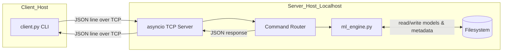
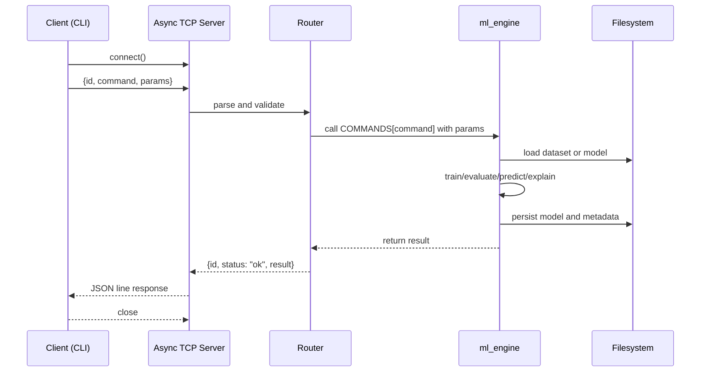
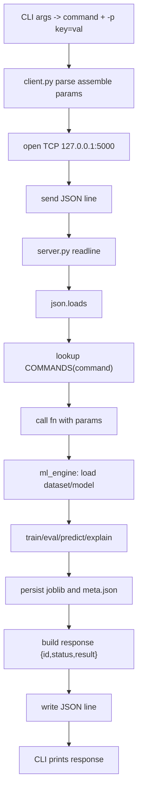

# MCP-Based Local ML Inference Server

A lightweight, local, line-delimited JSON over TCP server that exposes a set of ML workflows (dataset listing, training, evaluation, prediction, explanation, model export) to clients. The system is intentionally simple, composable, and easy to extend.

- Transport: TCP on localhost (127.0.0.1:5000)
- Protocol: one JSON message per line (newline-delimited)
- Runtime: asyncio (optionally uvloop)
- ML stack: scikit-learn, pandas, numpy, joblib
- Persistence: filesystem (`datasets/`, `models/`)

## Architecture



- `client.py` opens a TCP connection, sends a single JSON message terminated by `\n`, then reads a single line response.
- `server.py` accepts connections, parses each line to a JSON object, dispatches to a function in `ml_engine.py` using a command map, and returns the result as JSON.
- `ml_engine.py` executes CPU-bound ML tasks and persists models and metadata on disk with joblib and JSON.

## On-the-wire protocol

Each application message is a single JSON object per line (newline-delimited). Envelope fields:
- `id`: string; caller-chosen correlation id (generated by client)
- `command`: string; must exist in the server command map
- `params`: object; command-specific named parameters

Server response:
- `id`: echoes the request id
- `status`: `"ok"` or `"error"`
- `result`: command-specific payload (on success) or error string (on failure)
- `trace`: optional Python traceback (only on error, for debugging)

### Sequence



### Message examples

Train a model:
```json
{"id": "a1b2c3d4", "command": "train_model", "params": {"dataset": "iris.csv", "algorithm": "logistic_regression"}}
```
Successful response (truncated):
```json
{
  "id": "a1b2c3d4",
  "status": "ok",
  "result": {
    "model_id": "logistic_regression_XXXXXXXX",
    "algorithm": "logistic_regression",
    "dataset": "iris.csv",
    "target_col": "target",
    "hyperparams": {"max_iter": 300, "solver": "lbfgs", "multi_class": "auto"},
    "metrics": {"accuracy": 0.97, "precision_macro": 0.97, "recall_macro": 0.97, "f1_macro": 0.97}
  }
}
```

Error response (example):
```json
{
  "id": "a1b2c3d4",
  "status": "error",
  "result": "FileNotFoundError: /path/to/datasets/missing.csv",
  "trace": "Traceback ..."
}
```

## Components

- `client.py`: minimal CLI that builds `{id, command, params}`, prints the one-line response.
- `server.py`: asyncio TCP server, line reader, JSON parser, command dispatcher (`COMMANDS` map), error handler.
- `ml_engine.py`: dataset IO, training, evaluation, prediction, explanation, listing, export, persistence.
- `datasets/`: CSVs; columns are features + a `target` column by default.
- `models/`: persisted `*.joblib` model binaries and `*.meta.json` metadata.

## Execution flow (step-by-step)



## Setup

- Python 3.10+
- Install dependencies:
  - Create venv (optional) and `pip install -r requirements.txt`
- Prepare datasets: `python dataset_utils.py` (creates `datasets/iris.csv`, `datasets/wine.csv`)
- Start server: `python server.py`
- Use CLI from another terminal:
  - `python client.py list_datasets`
  - `python client.py train_model -p dataset=iris.csv -p algorithm=logistic_regression`
  - `python client.py list_models`
  - `python client.py evaluate_model -p model_id=YOUR_MODEL_ID`
  - `python client.py predict -p model_id=YOUR_MODEL_ID -p input_list='[[5.1,3.5,1.4,0.2]]'`
  - `python client.py explain_prediction -p model_id=YOUR_MODEL_ID -p input_row='[5.1,3.5,1.4,0.2]'`

Note: The CLI supports multiple `-p` occurrences or multiple key=val pairs after one `-p`.

## Supported commands (params -> result)

- `list_datasets()` -> `["iris.csv", ...]`
- `train_model(dataset, algorithm="logistic_regression", target_col="target", test_size=0.2, random_state=42, hyperparams=None)` -> training metadata with metrics; persists model + meta
- `evaluate_model(model_id, dataset?=None, target_col?=None)` -> metrics on specified or original dataset
- `predict(model_id, input_list: List[List[float]])` -> `{predictions: [...], probabilities: [[...]]?}`
- `explain_prediction(model_id, input_row: List[float], dataset_for_baseline?=None, target_col?="target", n_repeats=5)` -> feature importances using coef_/feature_importances_/permutation
- `list_models()` -> array of metadata documents
- `export_model(model_id, export_format="joblib")` -> `{"export_path": "..."}`

## Under the hood

- Async IO: `asyncio.start_server` handles multiple clients concurrently; each connection is processed line-by-line. Long CPU-bound ML calls block only the per-connection task; other connections continue to be served.
- Optional event loop: `uvloop` is used if available for faster networking.
- Framing: newline-delimited JSON messages keep the protocol simple; one request -> one response per connection in current CLI.
- Routing: static dict `COMMANDS` maps `command` string to python function; dispatch uses `fn(**params)` when `params` is a dict.
- Persistence: models saved with `joblib`, metadata in co-located `*.meta.json` with metrics and provenance. Datasets are plain CSV loaded via pandas.
- ML defaults: `logistic_regression` supplies safe defaults (`max_iter=300`, `solver=lbfgs`, `multi_class=auto`). Metrics are macro-averaged for multiclass.

## Extending the server

1) Implement a function in `ml_engine.py` (pure-python, raise exceptions on invalid inputs).
2) Add it to the `COMMANDS` map in `server.py` with a unique `command` string.
3) Update client-side invocation (e.g., script, CLI, or other callers) to send `{command, params}`.
4) Keep results JSON-serializable. For large payloads, consider returning file paths.

Optional improvements:
- Offload CPU-bound work to a thread/process pool via `asyncio.to_thread` or `concurrent.futures`.
- Add streaming or chunked responses for long operations or large artifacts.
- Add authentication and TLS if exposing beyond localhost.

## Security considerations

- Designed for local use only: binds to 127.0.0.1 by default.
- No authentication/authorization; do not expose to untrusted networks.
- Input validation is minimal; commands operate directly on local filesystem and CSVs under the project tree.

## Performance notes

- Training and permutation importance are CPU-bound; prefer small test sizes and sensible hyperparameters for demos.
- Use `uvloop` for lower latency IO on supported platforms.
- Batch predictions with `predict(model_id, input_list=[[...], ...])` to amortize overhead.

## Troubleshooting

- Missing params: ensure the CLI passes `-p key=value` pairs; multiple pairs can follow one `-p`.
- File not found: dataset names are relative to `datasets/` (e.g., `iris.csv`).
- Target column: defaults to `target`; override with `-p target_col=...` if your CSV differs.
- Port already in use: another process is bound to 5000; stop it or change `HOST`/`PORT` in `server.py`.
- JSON parsing: requests and responses are single-line JSON; avoid newlines inside params unless the string is JSON-encoded.

## Directory layout

```text
mcp-model-server/
  client.py            # CLI client
  server.py            # asyncio TCP server + router
  ml_engine.py         # ML workflows
  dataset_utils.py     # sample dataset generation
  datasets/            # CSV datasets
  models/              # joblib models + meta.json
  requirements.txt     # dependencies
  example_session.sh   # demo sequence
```
